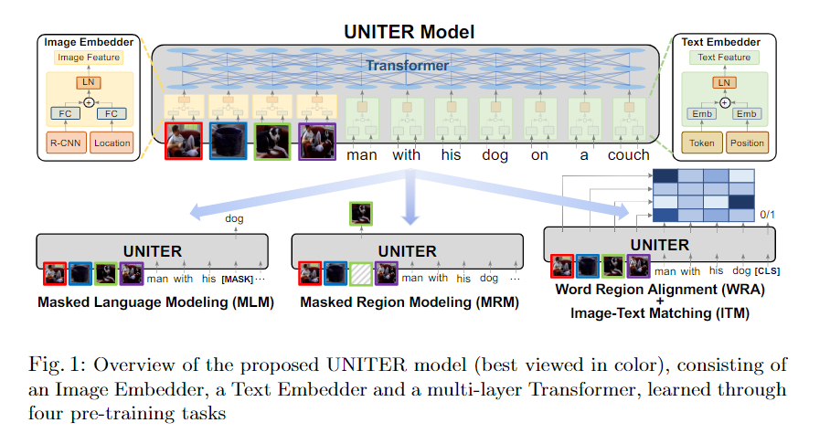

# Reading Notes  

- ## (*NIPS2019_ViLBERT*) ViLBERT: Pretraining Task-Agnostic Visiolinguistic Representations for Vision-and-Language Tasks. [[paper](https://arxiv.org/pdf/1908.02265.pdf)] [[code](https://github.com/jiasenlu/vilbert_beta)]  
    - ### 创新点  
        Vision-Language-Pretraining 的开山之作。  
    - ### 模型结构  
        模型整体采用双流 BERT (Transformer) 架构。  
          
        - #### Co-TRM 之前的部分  
            1. 文本端就是一个 BERTBASE (文中也提到使用 BERTLARGE 可能效果会更好)；  
            2. 图像端使用预训练好的 Faster-RCNN 提取图片的 region features, 每个 region feature 与其位置编码(5维：左上、右下坐标以及region的覆盖占比，映射到与 region feature 相同维度)相加得到最终的区域特征。每个图像序列以 &lt;IMG&gt; 开始，用来作为整个图像的表征(就如同文本序列中的 &lt;CLS&gt;)。  
        - #### Co-TRM  
              
            图像端的 Q 来自图片信息，但 K 和 V 来自文本信息；文本端的 Q 来自文本信息，但 K 和 V 来自图像信息。通过这种方式完成图像和文本之间信息的交互。  
    - ### 预训练任务  
        - #### Masked Multi-Modal modelling  
              
            1. 文本的 mask 策略与 BERT 一样。  
            2. 图像的 mask 策略为：mask 掉 15% 的 region inputs, 其中 0.9 的概率直接 mask, 0.1 的概率保持不变。需要注意的是，ViLBERT 并不是还原被 mask 掉的区域特征值，而是预测对应区域的类别分布，ground-true 是由预训练好的目标检测器(文中为 Faster-RCNN)给出的，优化目标是最小化两个分布的 KL 散度。  
        - #### Multi-Modal Alignment Prediction  
              
            即图文匹配任务：将 &lt;IMG&gt; 和 &lt;CLS&gt; 的输出做 element-wise product 得到的结果作为最终的总体表征，然后接一个二分类器判断图文是否匹配即可。  

- ## (*EMNLP2019_LXMERT*) LXMERT: Learning Cross-Modality Encoder Representations from Transformers. [[paper](https://arxiv.org/pdf/1908.07490.pdf)] [[code](https://github.com/airsplay/lxmert)]  
    - ### 模型结构  
        模型整体采用双流 Transformer 架构。  
          
        - #### Input Embeddings  
            - ##### Word-Level Sentence Embedding  
                  
            - ##### Object-Level Image Embedding  
                  
        - #### Encoders  
            - ##### Object-Relationship Encoder  
            - ##### Language Encoder  
            - ##### Cross-Modality Encoder  
                  
    - ### 预训练任务  
        为了使模型能够将视觉概念和语言语义关联起来，作者设置了掩码语言建模、掩码目标预测、跨模态匹配、图像问答等预训练任务，在大量“图像句子对”数据集上对模型进行了预训练。  
          
        - #### Masked Cross-Modality Language Model  
            此处的设置与 BERT 中的 MLM 基本相同，但 LEXMERT 不仅可以从文本中推断被遮蔽的单词，它还能在视觉信息中选择相应的信息来辅助寻找被遮蔽的单词。  
        - #### Masked Object Prediction  
            首先以 0.15 的概率对图片中的 object 进行随机 mask，被 mask 掉的 object 的 feature 置为全 0，模型通过视觉信息和语言信息结合来推断出 masked object 的 feature 和 label。  
            该任务分为以下两个子任务：  
            - RoI Feature Regression：使用均方损失来预测被 mask 掉的 object 的 RoI Feature，这个过程不需要语言信息的帮助，可以使模型学习到 object 之间的关系；  
            - Detected Label Classification，结合了视觉信息和语言信息进行联合预测，所有 object 的标签都是由 Faster RCNN 给出的。  
        - #### Cross-Modality Matching  
            以 0.5 的概率将正常图文对中的句子换掉，分类器需要判断图文是否匹配。  
        - #### Image Question Answering  

- ## (*ACL2020_VisualBERT*) VisualBERT: A Simple and Performant Baseline for Vision and Language. [[paper](https://arxiv.org/pdf/1908.03557.pdf)] [[code](https://github.com/uclanlp/visualbert)]  
    - ### 创新点  
        上面介绍的 LXMERT 和 ViLBERT 都是双流模型，而本篇的 VisualBERT 便是单流模型的开篇之作。(双流模型可以视为视觉表征和语言表征的后融合，单流模型可以视为视觉表征和语言表征的早融合。)  
    - ### 模型结构  
        整体模型架构就是一个 EBRT。  
          
        - #### 模型输入  
            1. 文本的输入格式和 BERT 一致。  
            2. 图像输入：region feature + segment embedding(用于区分输入中的 image 和 text) + position embedding。  
    - ### 预训练任务  
        1. Masked Language Model：利用上下文信息(既包括视觉信息也包括语言信息)来预测被 mask 掉的词。  
        2. Sentence-image Prediction：利用 [CLS] 的输出接二分类器判断图文是否匹配。  
    - ### 微调  
        [CLS] 的最终输出即为视觉-语言的联合表征，利用它来做下游任务，进行微调。  

- ## (*AAAI2020_Unified-VLP*) Unified Vision-Language Pre-Training for Image Captioning and VQA. [[paper](https://arxiv.org/pdf/1909.11059.pdf)] [[code](https://github.com/LuoweiZhou/VLP)]  
    - ### 创新点  
        1. 提出了一个统一的 VLP 模型，既可以做 Vision-Language 理解任务(如 VQA)，也可以做生成任务(如 Image Captioning).  
        2. 统一了 Encoder 和 Decoder.  
    - ### 模型结构  
        整体架构就是一个类 BERT。  
          
        - #### 模型输入  
            1. 图片输入如下，其中 Ri 为使用现成的目标检测器提取到的第 i 个区域的 region feature，Ci 为第 i 个区域目标的类别分布，Gi 为第 i 个区域的位置信息(5维：左上和右下坐标以及该区域对于整张图片的覆盖占比)，[·|·] 为拼接操作。**文中提到在本工作中将区域目标的类别直接合并进最终的区域特征中这一做法要比像 ViLBERT 中做 masked region prediction 这个预训练任务效果更好。**  
              
            2. 文本输入和 BERT 输入是一样的。  
            3. [CLS] 表示视觉信息输入的开始，[SEP] 用以区分视觉输入和语言输入，[STOP] 表示文本输入的结束，[MASK] 表示文本中被 mask 掉的词。  
    - ### 预训练任务  
        整体遵循 BERT 中的 Masked Language Model，设计了两个特定的任务：双向掩码 LM和单向掩码 LM，两者的唯一区别在于做 self-attention 时的 mask 方式不同。在预训练过程中，两个目标交替进行，两者所占的比例由超参 λ 和 1-λ 决定。  
        1. 双向掩码(bidirectional objective)：和 BERT 中一样，使用双向的上下文来预测被 mask 掉的词。  
        2. 单向掩码(seq2seq objective)：要满足自回归 LM 的条件，即只能通过上文来预测被 mask 掉的词。  
    - ### 如何在下游任务上做微调  
        1. VQA：将 VQA 视作一个多标签分类 ([多标签分类任务中的损失函数](https://zhuanlan.zhihu.com/p/98322026)) 问题，将 [CLS] 和 [SEP] 最终的输出做 element-wise product，然后接一个 MLP (Linear + ReLU + Linear + Sigmoid) 进行分类即可。  
        2. Image Captioning：首先将图片、[CLS]、[SEP] 输入模型，然后喂给模型一个 [MASK] 标记即开始生成，用上文来预测 [MASK] 对应的词，重复以上生成过程，直到生成 [STOP] 标记。  

- ## (*ECCV2020_UNITER*) UNITER: UNiversal Image-TExt Representation Learning. [[paper](https://arxiv.org/pdf/1909.11740.pdf)] [[code](https://github.com/ChenRocks/UNITER)]  
    - ### 创新点  
        1. 提出了一种基于条件的 mask 机制 (conditional masking)；  
        2. 提出了一个新的预训练任务 WRA (Word-Region Alignmen)。  
    - ### 模型结构  
          
    - ### 预训练任务  
        - Masked Language Model (MLM)：掩码语言模型，和 BERT 中设置相同。  
        - Masked Region Modeling (MRM)：随机 mask 掉 15% 的 image regions (置 0)，包含以下三种形式：  
            - Masked Region Feature Regression (MRFR)：使用 L2 regression 来预测被 mask 掉的 region 的 RoI Feature。  
            - Masked Region Classification (MRC)：预测被 mask 掉的 region 的语义类别。  
            - Masked Region Classification with KL-Divergence (MRC-kl)：预测被 mask 掉的 region 的语义类别分布，优化目标是最小化该其与 grount-truth (由目标检测器给出) 类别分布的 KL 散度。  
        &nbsp;  
        > 本文的一个创新点就是提出了一种与之前工作不同的 mask 机制 (conditional masking)，即在每一轮，只 mask 掉一种模态的信息，另一模态的信息保持完整 (要么只 mask 掉文本中的 tokens，要么只 mask 掉图片中的 region)。文中说这样做更符合人类的思考方式，即掩盖一段文字，可以通过其余文字和图像进行补齐，反之亦然。  
        - Image-Text Matching (ITM)：[CLS] (模型图中未画出) 的输出接分类器做二分类，判断图文是否匹配 (类似于 BERT 中的 NSP)。  
        - Word-Region Alignment (WRA)：本文提出的一个新的预训练任务 —— 对齐 word 和 region，使用最优传输理论 (Optimal Transpor) 来做这个任务。  
